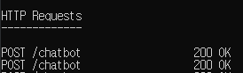

# Flask서버 / Chatbot / ngrok

- Chatbot Python Code : https://github.com/baw6114/chatbot

## 웹 프레임워크

### flask를 이용한 서버 설치법

- https://www.palletsprojects.com/p/flask/
- 위의 주소에 나와있는 Python 코드와 cmd명령어를 이용해서 서버를 실행할 수 있다

### 동적 라우팅

- 정적 라우팅과 동적 라우팅에 대해서 아래에서 간단하게 이해해 볼 수 있다 더 자세한 내용은 구글 검색
- https://m.blog.naver.com/PostView.nhn?blogId=minki0127&logNo=220796459560&proxyReferer=https%3A%2F%2Fwww.google.com%2F
- 라우팅이란?
- [https://ggo-ack.tistory.com/entry/%EB%9D%BC%EC%9A%B0%ED%8C%85%EC%9D%B4%EB%9E%80](https://ggo-ack.tistory.com/entry/라우팅이란)

## Telegram_Chatbot

### TelegramChatbot API

- https://core.telegram.org/bots/api

### Chatbot 만들기 / ngrok(주소를 부여해줌(Fowarding))

#### 웹 훅(web hook)

```
$>ngrok.exe http <port>
```

- ngrok.exe 파일이 있는 경로에서 위와 같이 cmd에서 작성을 하고

```python
https://api.telegram.org/bot<token>/setwebhook?url=<ngrok으로 생성한 주소>/chatbot
#생성한 주소는 다음과 같은 형태 : https://d69e122b.ngrok.io
```

- 위와 같이 브라우저에 작성하면 현재 잘 연결되었는지 확인할 수 있다(웹 훅 성공 시 페이지는 아래와 같음)
- chatbot에서 다음과 같은 리턴을 주고 있기 때문에 Telegram측에서 제대로 받았다는 확인을 한다

```python
return '',200	#status code인 200이 중요, 이 code로 telegram서버에서 상태를 판단
```



* ngrok.exe 측 상태


* 내 flask서버 측 상태

- 위와 같이 나타나면 정상적으로 수신이 된 것


## Python Anywhere

- 호스팅 사이트 : https://www.pythonanywhere.com/
- Python Anywhere은 무료로 사용 가능하지만 환경이 특이하므로 몇몇 특이점들이 있다
- $>pip 가 아닌 $>pip3 install 이런 식으로 작성이 필요 python버전이 2.7버전대이므로  유의 필요

### .env파일을 이용한 보안 강화

```python
from decouple import config

token = config('TOKEN')
```

```python
.env파일 내용
TOKEN='고유 토큰 값' #양식을 꼭 지켜야함
```

- 위와 같이 작성하여 .env에 별도로 token값을 저장함으로써 보안성을 높일 수 있음

## Tip사이트

- Dict형식을 Json형식으로 바꿔주는 사이트 : https://codebeautify.org/python-formatter-beautifier
- 네이버 API를 이용 가능한 사이트 : https://developers.naver.com/main/
- 현재 네이버 파파고 이용하여 chatbot에 이용 중