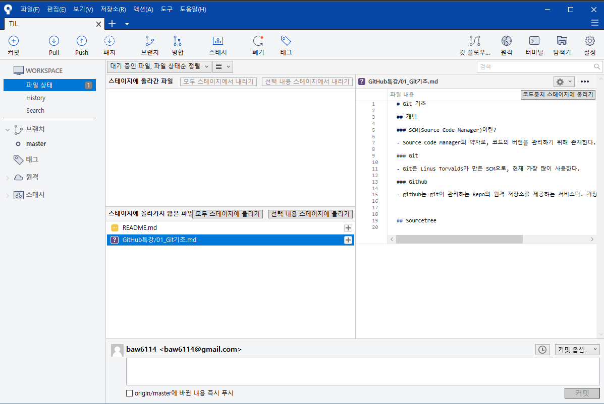

# Git 기초

## 개념

### SCM(Source Code Manager)이란?

- Source Code Manager의 약자로, 코드의 버전을 관리하기 위해 존재

### Git

- Git은 Linus Torvalds가 만든 SCM으로, 현재 가장 많이 사용

### Github

- github는 git이 관리하는 Repo의 원격 저장소를 제공하는 서비스/ 가장 많이 사용하며, 오픈소스 프로젝트들이 성장하는 곳. 최근 MS에 인수되었다.

## Sourcetree

- GitHubDesktop과 같은 용도의 툴
- 좀 더 세부적인 기능들이 많이 존재

## MarkDown

- 개발자들의 설명문서라고 할 수 있음
- 현재 문서가 MarkDown 
- Typora라는 Editor를 사용하면 매우 편하게 작성 가능
- 앞으로도 지속적으로 사용을 하도록 노력할 예정

