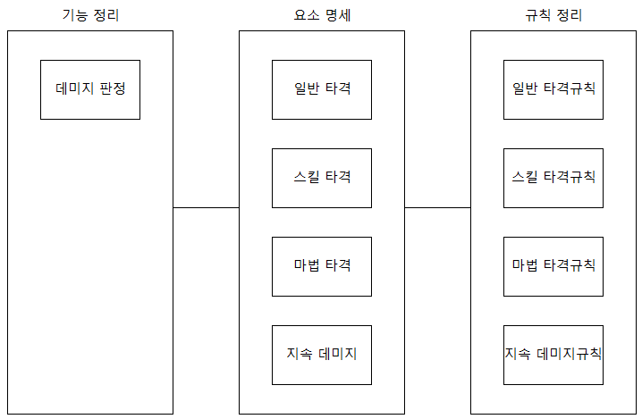

# 요소 명세

## 요소 정의

- 시스템은 크게 규칙과 요소에 의해 설명 가능
- 캐릭터, 아이템, 스킬 등과 스탯, 강화 같은 추상적인 개념 등이 요소가 된다
- 요소들은 수직적, 수평적 관계가 있을 수 있다

## 요소의 개념과 원리 작성

- 정의에서는 사소한 원리나 개념도 놓치지 않고 기술하는 것이 좋다
- ex) 체력은 캐릭터의 HP로 0이 되면 죽는다 / 체력은 캐릭터의 건강과 관련된 수치로 방어력과 저항력에 사용된다
- 공대 기획자는 만들기 편한 기획을 만든다 / 반면에 문과 ㆍ 디자인 출신은 기술적 한계성을 모르는 상태에서 제작하므로 회사의 방향성과 맞지 않은 경우도 생긴다

## 요소들의 데이터 구조

- 테스트를 해보며 변경해야되는 데이터의 경우는 변수로 제작하여 입력하며 테스트 할 수 있도록 요청해야한다
- 팝업창에 띄우는 텍스트도 고유 아이디 값을 지정하여 변수로 빼둔다면 수정이 용이해진다

## 요소 명세

- 글도 좋지만 그림과 다이어그램 등을 활용해 가독성이 좋게 만드는 것이 좋다

# 규칙 작성

## 규칙 작성 과정

### 규칙 목록 작성

## 육하원칙에 따른 작성

- 열심히 적응해서 작성하도록 노력해보자

## 요소 규칙

- 시스템의 기능과 동작에 대한 설명

## 예외 규칙

- 예외 규칙은 안 만드는 것이 좋다