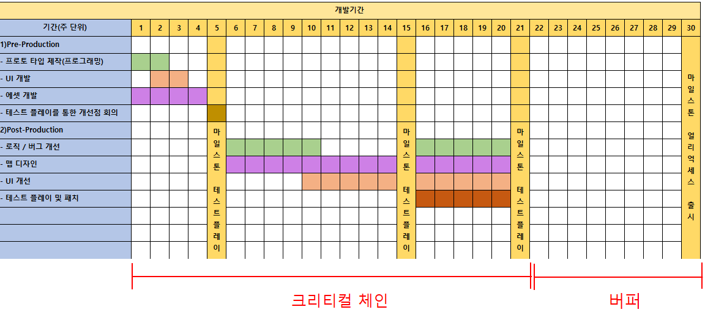

# 프로젝트 관리

## 프로젝트의 특징

- 목표 달성
- 정해진 일정 내에 성취가 반드시 필요

### 프로젝트를 수주하는 방법

- 수주를 하는 업종에서는 저가수주라는 방식이 존재
- 떨어지는 기술력을 낮은 가격을 제시함으로써 보완

### 프로젝트의 타당성 분석

|         | 사업 계획서                                                  |
| ------- | ------------------------------------------------------------ |
| WHY?    | 사업의 배경 / 목적                                           |
| WHAT?   | 구현내용, 기술, 일정, 자원, 예산                             |
| BENEFIT | 기대 효과  정성적 : 비수입적 부분  정량적 : 수입적 부분 |

### 프로젝트와신뢰도

- 신뢰도가 높을수록 프로젝트를 수주할 확률이 높아짐
- 신뢰도는 성공적으로 프로젝트를 수행할 시에 점차 쌓여짐
- 때로는 고객관계 유치를 위해서 실제 BENEFIT은 좋지 않음에도 불구하고 진행하는 경우도 존재

# IT사업

## IT사업의 특징

### IT사업으로 인해 변하는 것

- 업무적 변화
- 시스템 변화
- 조직 변화

### 컨설팅 회사를 쓰는 이유

- 경험(전문성)
- 객관성
- 책임소재, 리스크의 전가(ex)조직내에선 하기힘든 구조조정과 인력관리)

### SI와 SM

- SI(System Integration) : 신규 시스템을 구축 및 서비스
- SM(System Maintanance) : Legacy(기존시스템)의 기능 개선 및 유지 보수

# IT프로젝트

## 프로젝트의 규모와 성공

- 프로젝트의 규모가 커질수록 성공확률이 현저하게 낮아진다
- 프로젝트의 규모가 작을수록 성공확률이 높다

위와 같은 현상이 발생하는 이유는 다음과 같은 IT프로젝트의 특징에서도 찾을 수 있다

### IT프로젝트의 특징

- 진행상황을 가시적으로 정확히 판단하기가 힘듦
- 투입인력(개발자) 의존도가 높은 속성을 갖음(사람마다 퍼포먼스의 갭이 크다)
- 초기에 사용자 요구사항을 명확히 정의하기가 어렵다
- 대부분 일괄계약형태로 진행

## 프로젝트를 성공시키기 위한 방법론들

### 워터폴 방법 

- 폭포수가 물처럼 떨어지는 형태로 프로젝트의 순서가 진행된다
- 검증을 거의 끝자락에서 진행하기때문에 추가적인 요구가 발생 시 시간적 여유가 부족
- 대부분의 IT프로젝트들이 성공적인 프로젝트 진행이 잘 되지 않는 이유

IT프로젝트들은 대부분 끝의 고객사의 요구사항이 추가적으로 생김
이에 따라 기한을 늘리게 되는 바람에 일정 초과로 인한 코스트 발생 
또는 기한에 맞추기 위한 인력 충원으로 인한 코스트 증가가 발생
위와 같은 경우가 빈번하게 일어나므로 성공적인 프로젝트 수행이 힘들다

### 애자일 방법

- 워터폴 방법을 프로젝트에서 쪼개어낸 기능 단위로 진행하는 방식
- 각 단위기간들을 스프린트라고 명명 2주 ~ 최대 4주간의 기간을 설정
- 각 단위기간에서 성취하지 못한 사항들은 다음 스프린트에서 어떤 것을 우선 순위에 둘 것인지에 대해서
  회의를 거쳐 산정
- 마지막 스프린트에는 상대적으로 중요도가 떨어진다고 생각되는 요소들만 남으므로 이 기간에 어떤 것을
  개발하고 어떤 것을 버릴 것인지에 대해 의사결정이 필요

애자일 방법론은 이론적으로는 이상적이나, 고객사 측에서는 수주를 주었음에도 불구하고 짧은 기간 단위로
지속적인 방문이 필요 이는 곧 시간과 돈의 소모로 이어지므로 선호하지 않음

### WBS(Work Breakdown Structure)

- 마일스톤을 작성하는 것처럼 어떤 기간에 어떤 업무를 할 지를 기간을 정해서 나타내는 방식
- MS의 Project라는 Tool이 존재

개발기간 산정에서 Buffer를 두는 것은 중요

위와 같이 일정을 짤 때, '버퍼'라는 기간을 둠으로써 예상치 못한 문제가 생겼을 때, 대처 가능한 상황을 만듦
단, 크리티컬 체인 기간이 조금 빡빡하게 흘러가는 것이 맞음