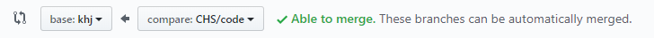
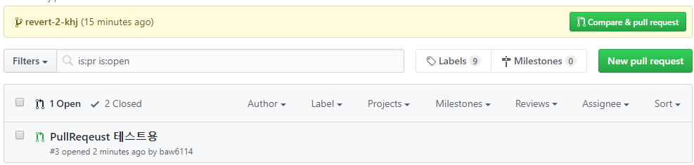
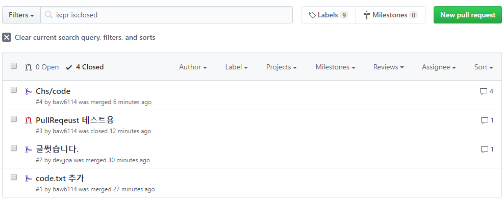

# Git 중급

## 충돌과 병합

### 충돌(Conflict)

- 협업을 하는 중 같은 파일을 작업할 경우 항상 발생하는 문제
- 충돌이 나는 작업자 상호 간에 이야기가 반드시 필요하다

### 병합(Merge)

- 브랜치와 브랜치를 합치는 과정

- '마스터'는 최초의 커밋 이후로는 Merge만이 존재하는 것이 가장 바람직하다
- 일반적으로 커밋은 각각의 브랜치들에서만 이뤄져야한다

### Pull Request

- 각자의 브랜치에서 작업을 한 뒤 어떤 branch에 병합을 하길 원한다면, 해당 기능을 이용해서 작업을 한다. 마스터 또한 branch라고 볼 수 있기 때문에 어디에 합치려는 것인지를 리퀘스트 전에 결정을 해서 올리면 된다

- Github의 Repo에 Pull Request라는 탭에 Request가 올라오게 되고, 해당 Request를 확인한 뒤 합치는 것을 결정한다

- 다수의 인원이 협업을 할 시에 반드시 사용해야하는 기능
- 각각의 커밋에 대해서 리뷰를 남길 수도 있다
- Reject를 해서 변경을 거부할 수도 있다
- 닫힌 Pull Request도 확인할 수 있다

## 되돌리기(Revert 와 Reset 그리고 Checkout)

### Revert

- commit이력을 날리지 않고 되돌아갈 커밋과 그 사이의 커밋 내용들을 마치 없던 일인 것마냥 내용을 전부 되돌린다

.png)

- 위 그림과 같이 커밋의 이력이 사라지는 것이 아니라 새로운 커밋을 만들고 
  내용을 커밋1의 내용으로 모두 변경

### Reset

- 위의 그림과 같이 커밋 이후의 시점에서 리셋의 커맨드에 따라 되돌아가는 변경점의 위치가 달라진다
- Hard / Mixed / Soft가 있다
- Hard의 경우 변경사항이 모두 삭제되므로(복구 불가능) 주의해서 사용
- Reset 커맨드의 기본 설정은 Mixed

### Checkout

- 과거의 상태를 보러갈 수 있음 필요한 내용을 복사해서 가져오거나 할 수 있음
- 혹시라도 수정하고 커밋을 하면 굉장히 꼬일 수 있음 보는 용도 또는 단순히 해당 커밋버전의 파일을 뽑아낼 때만 쓰는 것이 좋음

## Git을 연습하기 좋은 사이트

- 시각화도 잘 되어있고 웹 상에서 커맨드들도 직접 연습을 직접해볼 수 있다

- http://try.github.io/
